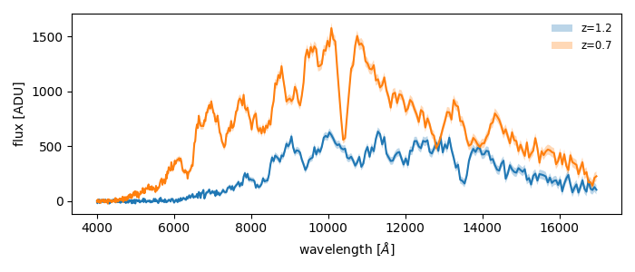

# slicersim
Simulation of Slicer observations

# Installation
```bash
git clone https://github.com/MickaelRigault/slicersim.git
cd slicersims
pip install .
```

# Quick look

```python
import slicersim
# => a simulation from a config 
config = slicersim.iotools.get_config(scene='supernova.toml')
sim = slicersim.Simulation.from_config(config)

# update the simulation (see sim.mutable_parameters)
sim.update(target__redshift=1.2)
lbda, flux_1, variance_1 = sim.get_spectrum(incl_error=True)

sim.update(target__redshift=0.7)
lbda, flux_2, variance_2 = sim.get_spectrum(incl_error=True)
```

and show your simulated spectra
```python
import matplotlib.pyplot as plt
import numpy as np
fig, ax = plt.subplots(figsize=[7,3])

ax.plot(lbda, flux_1)
ax.fill_between(lbda, 
                flux_1-np.sqrt(variance_1),
                flux_1+np.sqrt(variance_1), alpha=0.3,
               label="z=1.2")

ax.plot(lbda, flux_2)
ax.fill_between(lbda, 
                flux_2-np.sqrt(variance_2),
                flux_2+np.sqrt(variance_2), alpha=0.3,
               label="z=0.7")
ax.legend(frameon=False, fontsize="small")
ax.set(xlabel=r"wavelength [$\AA$]", ylabel="flux [ADU]")
```



# Estimation Time Calculator

Load your simulation
```python
config = slicersim.iotools.get_config(scene='supernova.toml')
sim = slicersim.Simulation.from_config(config)
```
Create the SN Ia of interest and fetch the correct number of read-out mode "groups"
```python
sim.update(target__redshift = 1, target__c=0.3, target__x1=-0.5)
ngroup, snr = sim.fetch_snr(10, lbda_range= [4000, 7000], frame="rest")
print(f"with {ngroup} groups you reach a snr of {snr:.2f}")
```
```bash
with 9 groups you reach a snr of 10.61
```
so let's set the simulation to this ngroup and get the exposure times information
```python
sim.update(ngroup=ngroup)
sim.get_times()
```
```bash
{'integration_time': 679.2,
 'exposure_time': 724.48,
 'tframe': 2.83,
 'tgroup': 45.28}
```

# Credits
_adapted from the original MLAPerf v:0.18.0 developed by Y. Copin and M. Rigault_
