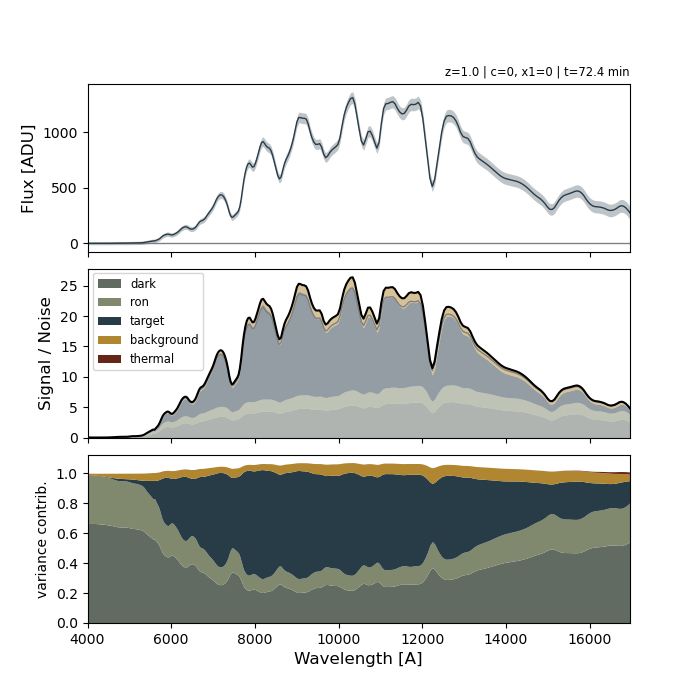

# slicersim
Simulation of Slicer observations

***
# Installation
```bash
git clone https://github.com/MickaelRigault/slicersim.git
cd slicersims
pip install .
```
or
```bash
pip install git+https://github.com/MickaelRigault/slicersim.git
```
***
# Top level ETC

## Any spectra
```python
import slicersim
import numpy as np

# provide your spectrum
lbda_ref = np.linspace(3000, 20_000, 500) # larger than lazuli bandpass
flux_ref = np.ones(lbda_ref.shape) # flat spectrum

# compute the exposure time needed any input spectrum
exptime, lazulitarget = slicersim.lazuli_etc(lbda_ref, flux_ref, snr=20, mag=21, band="bessellb")
print(exptime)
```
```bash
407.52
```

## Supernova
```python
import slicersim
import numpy as np

# compute the exposure time needed to observe a Supernovae
exptime, snia_target = slicersim.lazuli_sn_etc(snr=20, model="salt", redshift=1.2, x1=1.5, c=0.2, phase=-2.2)
print(exptime)
```
```bash
10142.72
```

***
**warning:** new simplified format on the way. documentation to be updated.
***
# Quick look

**warning:** new simplified format on the way. documentation to be updated.


```python
import slicersim
# => a simulation from a config 
config = slicersim.iotools.get_config(scene='supernova.toml')
sim = slicersim.Simulation.from_config(config)

# update the simulation (see sim.mutable_parameters)
sim.update(target__redshift=1.2)
lbda, flux_1, variance_1 = sim.get_spectrum(incl_error=True)

sim.update(target__redshift=0.7)
lbda, flux_2, variance_2 = sim.get_spectrum(incl_error=True)
```

and show your simulated spectra
```python
import matplotlib.pyplot as plt
import numpy as np
fig, ax = plt.subplots(figsize=[7,3])

ax.plot(lbda, flux_1)
ax.fill_between(lbda, 
                flux_1-np.sqrt(variance_1),
                flux_1+np.sqrt(variance_1), alpha=0.3,
               label="z=1.2")

ax.plot(lbda, flux_2)
ax.fill_between(lbda, 
                flux_2-np.sqrt(variance_2),
                flux_2+np.sqrt(variance_2), alpha=0.3,
               label="z=0.7")
ax.legend(frameon=False, fontsize="small")
ax.set(xlabel=r"wavelength [$\AA$]", ylabel="flux [ADU]")
```


***
# Details on ETC

See notebooks: 
 - [any spectrum](docs/notebooks/etc_of_any_spectrum.ipynb)
 - [supernova](docs/notebooks/etc_of_snia.ipynb)

***
# Study origin of variance

Once your simulator is loaded, you have several method to check the variance origin. 
- `estimate_variance_contribution`: that probe the variance origin for a given wavelength rate
- `estimate_variance_contribution_spectra`: similar but for whole spectrum
- `show_variance_sources`: plotting function associated to `estimate_variance_contribution_spectra`

```python
import slicersim
# load the correct simulator
config = slicersim.iotools.get_config(instrument='lazuli.toml')
sim = slicersim.Simulation.from_config(config)

# Set the target you want
sim.update(target__redshift=1., target__x1=0, target__c=0)

# look for the config needed to get an average SNR of 20 in [4000, 6800] rest-frame
new_config, snr, integration_time = sim.fetch_snr(20, lbda_range=[4000, 6800], frame='rest')
sim.update(**new_config) # let's set it

# get the expected spectrum (in ADU)
lbda, flux, variance = sim.get_spectrum()

# Show details
fig = sim.show_variance_sources(flux_calibrated=False)
```


***
# PSF & Noise equivalent area

by default, the code assumes gaussian PSF both for spatial (at the slicer/mla) and cross-dispersion (at pixels) level.

`slicersim.profiles` contains additional PSF model (from [astropy.modeling](https://docs.astropy.org/en/latest/modeling/predef_models2D.html) 
that can be used to build 2D model or estimate the PSF noise equivalent area (nea).

*(more to come..., see: `slicersim.profiles.get_2dpsf_nea()`)*

***
# Credits
Developped by M. Rigault ; _adapted from the original MLAPerf v:0.18.0 developed by Y. Copin and M. Rigault_
