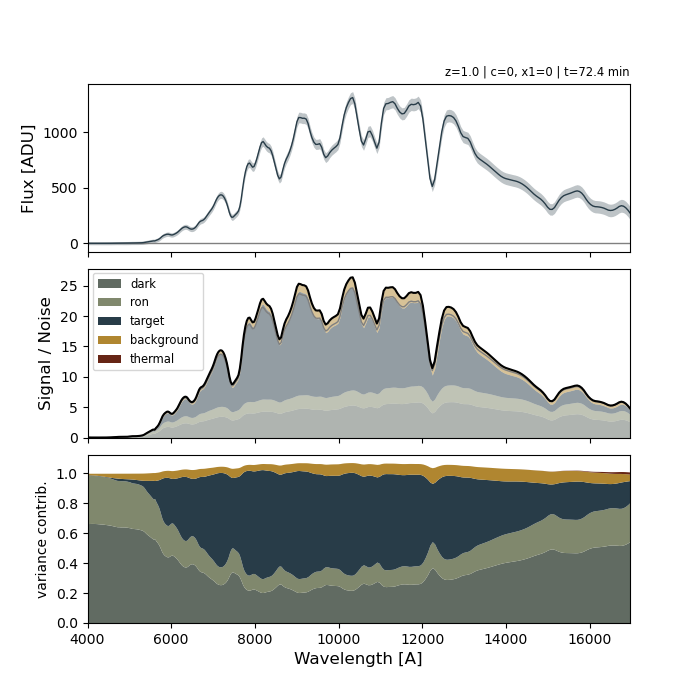

Key concepts
============

``slicersim`` is organised in layers. Each layer wraps the one below and
exposes fewer, higher-level choices. Start at the top and go down only when
you need more control.

.. list-table::
   :header-rows: 1
   :widths: 22 38 40

   * - Layer
     - Main objects
     - Use it to...
   * - **Exposure time calculators**
     - `~slicersim.lazuli.lazuli_etc`, `~slicersim.lazuli.lazuli_sn_etc`
     - get an exposure time in one line.
   * - **Targets**
     - `~slicersim.lazuli.LazuliSupernova`, `~slicersim.lazuli.LazuliKilonova`,
       `~slicersim.lazuli.LazuliTarget`, ... and `~slicersim.sample.Sample`
     - simulate a given astrophysical source with Lazuli: reach a SNR,
       get spectra, compare read-out modes or populations.
   * - **Simulation**
     - `~slicersim.simulation.Simulation`
     - control and inspect every parameter of the scene and the instrument.
   * - **Components**
     - `~slicersim.scene.scene.Scene`, `~slicersim.telescope.Telescope`,
       `~slicersim.spectrograph.SlicerSpectrograph`,
       `~slicersim.detector.Detector`
     - model a new instrument or a new kind of scene.

Targets
-------

A target is the recommended entry point. ``Lazuli*`` classes combine a
source with the Lazuli instrument configuration; they share the same
methods:

.. list-table::
   :widths: 40 60

   * - `~slicersim.target.VirtualTarget.change_properties`
     - change the source (redshift, phase, magnitude, ...).
   * - `~slicersim.target.VirtualTarget.change_detector`
     - set the read-out mode (``nmd``, ``max_group``, ``nramps``).
   * - `~slicersim.lazuli.VirtualLazuliTarget.change_spectrograph`
     - switch between the ``"narrow"`` (40 mas) and ``"wide"`` (80 mas) fields.
   * - `~slicersim.target.VirtualTarget.setup_to_snr`
     - find the read-out mode that reaches a requested signal-to-noise.
   * - `~slicersim.target.VirtualTarget.get_exposure_time`
     - total exposure time of the current configuration.
   * - `~slicersim.target.VirtualTarget.get_spectrum`
     - a realistic (noisy) spectrum and its variance.
   * - `~slicersim.target.VirtualTarget.get_variance_contribution`
     - the variance broken down by noise source.
   * - `~slicersim.lazuli.VirtualLazuliTarget.get_cube`
     - the simulated 3D data cube(s).

Every target holds its `~slicersim.simulation.Simulation` in
``target.simulation``, so you can always drop to the next layer.

Simulation
----------

A `~slicersim.simulation.Simulation` chains four components:

.. code-block:: text

   Scene  ──►  Telescope  ──►  Spectrograph  ──►  Detector  ──►  spectrum / cube

- **Scene**: point source, background (zodiacal light) and host galaxy;
- **Telescope**: aperture, PSF and thermal emission;
- **Spectrograph**: spaxel grid, dispersion, throughput and line spread;
- **Detector**: QE, dark current, read-out noise and MACC read-out mode.

It is built from a configuration dictionary, read from TOML files shipped
with the package:

.. code-block:: python

   import slicersim

   config = slicersim.get_config(scene="supernova.toml", instrument="lazuli_cbe.toml")
   sim = slicersim.Simulation.from_config(config)

Any of its parameters can then be changed with
`~slicersim.simulation.Simulation.update`, using either the full
``component__parameter`` name or an unambiguous short name:

.. code-block:: python

   sim.mutable_parameters                       # everything you can change
   sim.update(pointsource__redshift=1.0, c=0.1)
   sim.update(detector__nmd=(40, 10, 0), nramps=2)

   lbda, flux, variance = sim.get_spectrum()    # [ADU]
   sim.show_variance_sources()                  # what dominates the noise?

Noise sources
-------------

The variance of a simulated spectrum is the sum of the following
contributions, each of which can be switched off (``switch_off=[...]``) to
study its impact:

- **scene**: ``pointsource``, ``background`` (zodiacal light), ``host``;
- **instrument**: ``thermal`` (thermal emission of the optics);
- **detector**: ``dark``, ``thermal_dark``, ``roic_glow`` and ``ron``
  (read-out noise, which depends on the MACC mode).

See the :doc:`notebooks/beginner_variancesource` tutorial.

Units
-----

- wavelengths are in Angstrom;
- input fluxes are in erg s\ :sup:`-1` cm\ :sup:`-2` Å\ :sup:`-1`
  (or rescaled to a magnitude with ``mag`` and ``band``);
- simulated data are in ADU unless a ``unit`` is requested;
- times are in seconds, angles on the sky in arcsec.
