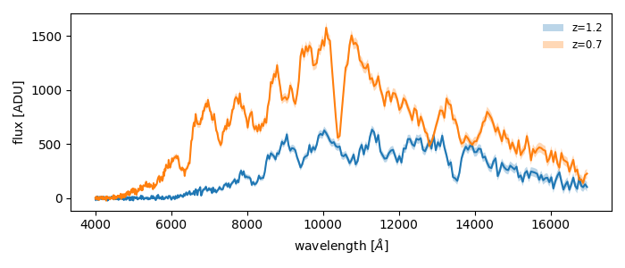

Getting started
===============

This page walks through the three steps of every ``slicersim`` workflow:

1. **Create a target** — what is observed.
2. **Set the observing configuration** — how it is observed.
3. **Get the simulated data** — what you measure.

.. tip::

   Only need an exposure time? Skip to :ref:`quickstart-etc`.

1. Create a target
------------------

A *target* bundles an astrophysical source with the full Lazuli instrument.
Pick the class matching your source:

.. tab-set::
   :sync-group: source

   .. tab-item:: Supernova
      :sync: sn

      .. code-block:: python

         import slicersim

         # a SALT Type Ia supernova
         target = slicersim.LazuliSupernova(redshift=1.0, x1=0, c=0.2, phase=1.5)

   .. tab-item:: Kilonova
      :sync: kn

      .. code-block:: python

         import slicersim

         # a POSSIS (Bulla 2023) kilonova seen at 30 degrees
         target = slicersim.LazuliKilonova(redshift=0.05, phase=1.4, theta=30)

   .. tab-item:: Black body
      :sync: bb

      .. code-block:: python

         import slicersim

         # a 5000 K black body with r = 20 mag
         target = slicersim.LazuliBlackBody(temperature=5_000, mag=20, band="sdssr")

   .. tab-item:: CalSpec star
      :sync: star

      .. code-block:: python

         import slicersim

         # any HST CalSpec standard, by name or short name
         target = slicersim.LazuliCalSpec("bd_17")

   .. tab-item:: Your spectrum
      :sync: any

      .. code-block:: python

         import numpy as np
         import slicersim

         # any spectrum, here a flat one, rescaled to g = 20 mag
         lbda = np.arange(3_000, 20_000, 0.5)  # [Angstrom]
         flux = np.ones_like(lbda)
         target = slicersim.LazuliTarget(lbda, flux, mag=20, band="lsstg")

Source parameters can be changed at any time with
`~slicersim.target.VirtualTarget.change_properties`, e.g.
``target.change_properties(redshift=1.2)``.

2. Set the observing configuration
----------------------------------

The exposure time is set by the detector read-out: the MACC mode
``nmd = (n_groups, n_frames_per_group, n_drops)`` and the number of ramps.
Either let ``slicersim`` find it for you, or set it yourself.

.. tab-set::

   .. tab-item:: Reach a signal-to-noise

      .. code-block:: python

         # mean SNR of 20 per resolution element in [5000, 6000] Å rest-frame
         config, reached_snr = target.setup_to_snr(
             20, per_resolution=True, lbda_range=[5000, 6000], frame="rest"
         )

   .. tab-item:: Fix the read-out

      .. code-block:: python

         # 40 groups of 10 frames, no drop, repeated over 2 ramps
         target.change_detector(nmd=(40, 10, 0), nramps=2)

Then inspect the result:

.. code-block:: python

   target.get_exposure_time()   # total exposure time [s]
   target.get_readout_config()  # {'nmd': (...), 'nramps': ...}
   target.get_data_volume()     # [GB]

3. Get the simulated data
-------------------------

.. code-block:: python

   # a noisy spectrum and its variance
   lbda, flux, variance = target.get_spectrum(unit="flambda")

   # which noise source dominates? (one column per contribution)
   contributions = target.get_variance_contribution()

``get_spectrum`` accepts the following units:

=============  ===============================
``unit``       meaning
=============  ===============================
``adu``        total counts (default)
``flambda``    erg s\ :sup:`-1` cm\ :sup:`-2` Å\ :sup:`-1`
``fphoton``    photons s\ :sup:`-1`
``rate``       ADU s\ :sup:`-1`
``framerate``  ADU per frame
=============  ===============================

Pass ``incl_error=False`` to get the noiseless expectation instead of a
random realisation.

A quick plot:

.. code-block:: python

   import matplotlib.pyplot as plt
   import numpy as np

   fig, ax = plt.subplots(figsize=(7, 3))
   ax.plot(lbda, flux)
   ax.fill_between(lbda, flux - np.sqrt(variance), flux + np.sqrt(variance), alpha=0.3)
   ax.set(xlabel="wavelength [Å]", ylabel="flux [erg/s/cm²/Å]")

.. _quickstart-etc:

One-line exposure time calculators
----------------------------------

When all you need is an exposure time, two functions do all of the above
in one call. Both return the exposure time and the configured target:

.. code-block:: python

   import numpy as np
   import slicersim

   # a Type Ia supernova
   exptime, target = slicersim.lazuli_sn_etc(
       "salt", redshift=1.2, snr=20, x1=1.5, c=0.2, phase=-2.2
   )

   # any spectrum, normalised to B = 21 mag
   lbda = np.linspace(3_000, 20_000, 500)
   exptime, target = slicersim.lazuli_etc(lbda, np.ones_like(lbda), snr=20, mag=21, band="bessellb")

Next steps
----------

- :doc:`concepts` explains how ``slicersim`` is organised, so you know
  where to look when you need more control.
- The :doc:`tutorials` cover each topic in depth.
